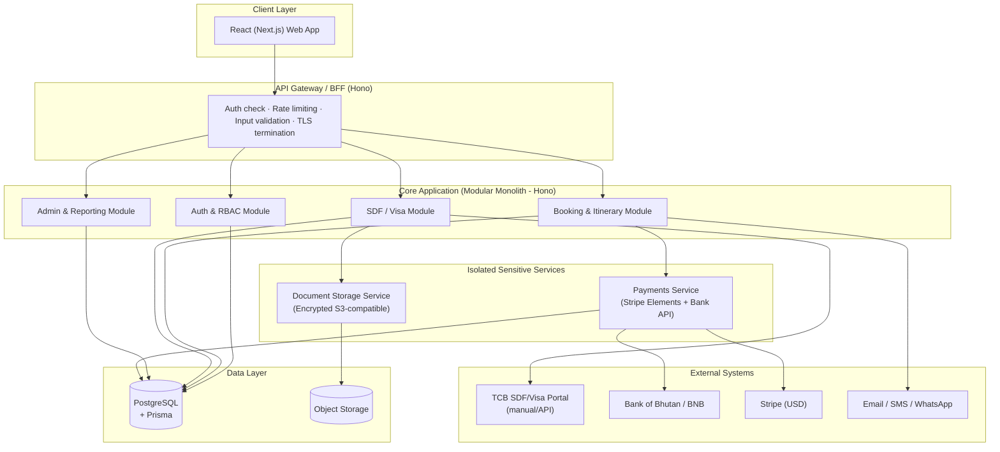
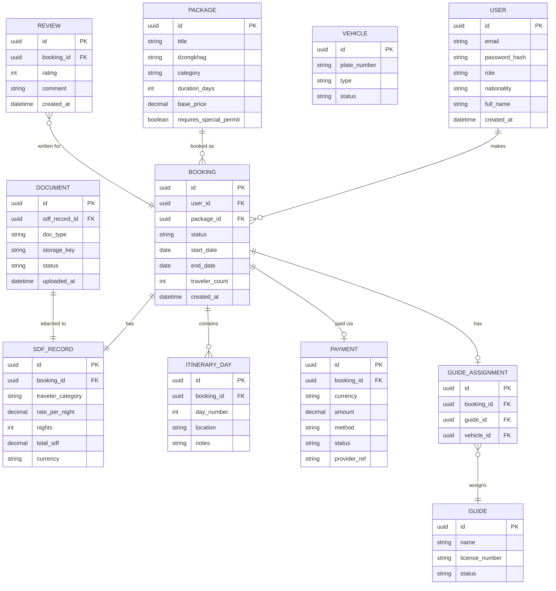
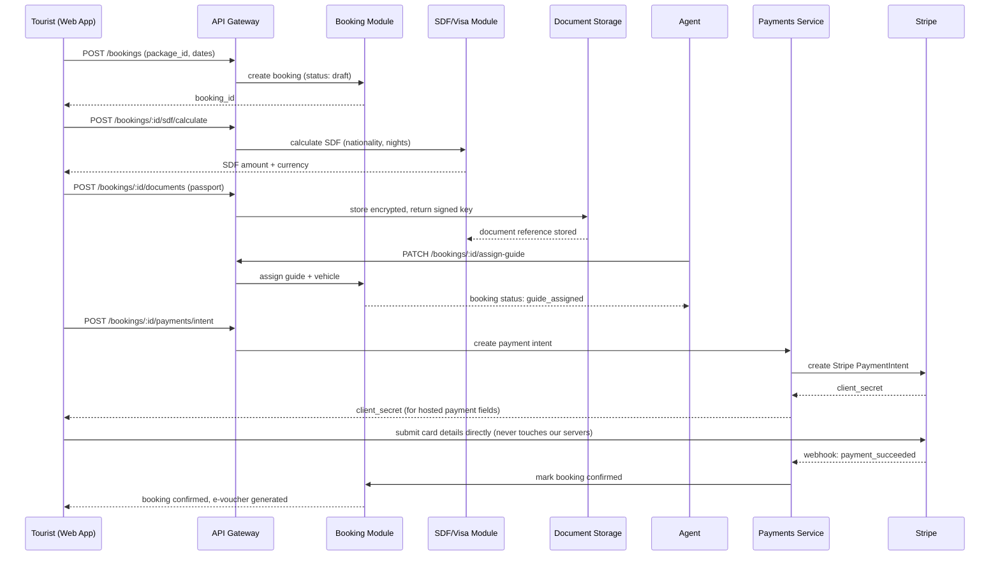

# System Design Document (SDD)

## DrukJourneys — Bhutan Travel Agency Website

**Version:** 1.0
**Date:** August 18, 2026
**Architecture style:** Modular monolith + isolated Payments and Document Storage services

---

## 1. Purpose

This document translates the SRS/PRD requirements and the approved architecture decision into a concrete design: component boundaries, data model, API contracts, and critical data flows. It is the reference used during implementation (Section 3 of the SDLC).

---

## 2. Architecture Overview

**Why this shape (recap):** the core app is one deployable unit for easier auditing and centralized RBAC enforcement; Payments and Document Storage are pulled out because they are the two highest-sensitivity data domains (card-adjacent data and passport/ID data) and benefit most from their own credentials and access boundary.

---

## 3. Component Responsibilities

| Component | Responsibility | Talks To |
|---|---|---|
| API Gateway | Single entry point; TLS termination, JWT verification, rate limiting, schema validation before requests reach business logic | All core modules |
| Auth & RBAC Module | Registration, login, password reset, role assignment (Tourist/Guide/Agent/Admin), JWT issuance | PostgreSQL |
| Booking & Itinerary Module | Package browsing, booking creation, guide/vehicle assignment, itinerary generation | PostgreSQL, Payments, Notifications |
| SDF/Visa Module | SDF calculation, document submission trigger, visa/permit status tracking | PostgreSQL, Document Storage, TCB portal |
| Admin & Reporting Module | Pricing/SDF rate management, guide/vehicle roster, TCB-aligned reports | PostgreSQL |
| Payments Service | Isolated handling of USD (Stripe) and BTN/INR (bank) payments; never stores raw card data | Stripe, Bank API, PostgreSQL (payment records only) |
| Document Storage Service | Encrypted storage of passport/ID uploads; issues short-lived signed URLs for authorized access | S3-compatible storage |

---

## 4. Entity-Relationship Diagram

---

## 5. API Contract Sketch

Base path: `/api/v1`. All endpoints require a valid JWT except `POST /auth/register`, `POST /auth/login`, and public `GET /packages` browsing routes.

### 5.1 Auth Module

| Method | Path | Auth | Description |
|---|---|---|---|
| POST | `/auth/register` | None | Create account; captures nationality to determine traveler category |
| POST | `/auth/login` | None | Returns access + refresh JWT |
| POST | `/auth/refresh` | Refresh token | Issues new access token |
| GET | `/auth/me` | Any role | Returns current user profile |

### 5.2 Packages Module

| Method | Path | Auth | Description |
|---|---|---|---|
| GET | `/packages` | None (public) | List/filter packages by dzongkhag, category, duration |
| GET | `/packages/:id` | None (public) | Package detail |

### 5.3 Booking Module

| Method | Path | Auth | Description |
|---|---|---|---|
| POST | `/bookings` | Tourist | Create a booking (draft status) for a package |
| GET | `/bookings/:id` | Owner / Agent / Admin | Booking detail including itinerary and SDF status |
| GET | `/bookings` | Owner (own) / Agent / Admin (all) | List bookings |
| PATCH | `/bookings/:id/assign-guide` | Agent / Admin | Assign guide + vehicle (blocks confirmation until set, per FR-15) |
| POST | `/bookings/:id/cancel` | Owner / Agent / Admin | Request cancellation |

### 5.4 SDF/Visa Module

| Method | Path | Auth | Description |
|---|---|---|---|
| POST | `/bookings/:id/sdf/calculate` | Tourist / Agent | Calculates SDF based on nationality, nights, traveler count |
| POST | `/bookings/:id/documents` | Tourist | Upload passport/ID document → forwarded to Document Storage Service |
| GET | `/bookings/:id/sdf-status` | Owner / Agent / Admin | Current visa/SDF/permit status |

### 5.5 Payments Module

| Method | Path | Auth | Description |
|---|---|---|---|
| POST | `/bookings/:id/payments/intent` | Owner | Creates a Stripe payment intent (USD) or bank payment reference (BTN) |
| POST | `/payments/webhook` | Signed webhook (Stripe) | Confirms payment success/failure asynchronously |
| GET | `/bookings/:id/invoice` | Owner / Agent / Admin | Itemized invoice (package cost + SDF, per FR-19) |

### 5.6 Admin Module

| Method | Path | Auth | Description |
|---|---|---|---|
| PUT | `/admin/sdf-rates` | Admin | Update SDF rate table (no redeploy needed, per NFR-9) |
| GET | `/admin/reports/bookings` | Admin | Bookings by source market/season/dzongkhag |
| POST | `/admin/guides` | Admin | Manage guide roster |

---

## 6. Critical Path Sequence Diagram

End-to-end flow: **Browse → Book → Submit SDF/Visa → Assign Guide → Pay → Confirm**

Note the key security property in this flow: card details go **directly from the browser to Stripe**, never through our API — this is what keeps the system largely out of PCI-DSS card-data scope.

---

## 7. Deployment View

| Environment | Purpose | Notes |
|---|---|---|
| Dev | Local development | Docker Compose: Postgres, local Hono server, mock Stripe/TCB |
| QA/Test | Automated + manual test execution | Sandbox Stripe, mocked TCB workflow |
| Staging | Pre-production / UAT | Sandbox or limited-scope real integrations |
| Production | Live | Real integrations, monitoring/alerting active, automated backups |

---

## 8. Traceability

This SDD implements the architecture agreed in the prior discussion and should be read alongside:
- `SRS_DrukJourneys.md` — source of FR-#/NFR-# requirements referenced throughout
- `PRD_DrukJourneys.md` — feature prioritization driving what's built first
- `SDLC_DrukJourneys.md` — sprint plan this design feeds into
- `STLC_DrukJourneys.md` — test cases should map back to the modules/endpoints defined here